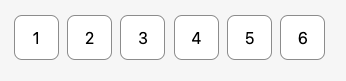

# vue3-otp

A simple and customizable OTP input component for Vue 3.



NOTE: This image showcases a styled OTP input using Tailwind CSS.

## ⚙️ Installation

### Install as a Package

You can install `vue3-otp` via the terminal:

```sh
pnpm i @va54/vue3-otp
```


## 📖 Usage

### Register Globally

```js
// main.js or main.ts
import { createApp } from 'vue';
import App from './App.vue';
import VOtp from "@va54/vue3-otp";

const app = createApp(App);
app.component('v-otp', VOtp);
app.mount("#app");
```

### Register Locally

```vue
<script setup>
import { ref } from 'vue';
import VOtp from "@va54/vue3-otp";

const otp = ref('');
</script>

<template>
  <v-otp v-model:value="otp" :num-inputs="6" input-type="tel" class="flex space-x-2" />
</template>
```

---

## 🔧 Props

| Name                 | Type        | Required | Default     | Description                                                                                                                                                          |
| -------------------- | ----------- | -------- | ----------- | -------------------------------------------------------------------------------------------------------------------------------------------------------------------- |
| `value`              | `string`    | ❌        | `""`        | `v-model:value` for binding dynamic value.                                                                                                                           |
| `num-inputs`         | `number`    | ✅        | `6`         | Number of OTP inputs to render.                                                                                                                                      |
| `separator`          | `component` | ❌        | `undefined` | Custom separator between inputs. Example: `<span>-</span>` to insert `-` between each input.                                                                         |
| `input-classes`      | `string`    | ❌        | `none`      | CSS class applied to each input.                                                                                                                                     |
| `input-type`         | `string`    | ❌        | `"tel"`     | Input type: `"number"`, `"tel"`, `"letter-numeric"`, `"password"`.                                                                                                   |
| `input-mode`         | `string`    | ❌        | `"numeric"` | Controls virtual keyboard type. Options: `"numeric"`, `"text"`, `"tel"`. [Learn More](https://developer.mozilla.org/en-US/docs/Web/HTML/Global_attributes/inputmode) |
| `auto-focus-enabled` | `boolean`   | ❌        | `false`     | Autofocuses input on page load.                                                                                                                                      |
| `should-focus-order` | `boolean`   | ❌        | `false`     | Ensures input order is maintained correctly.                                                                                                                         |
| `placeholders`       | `array`     | ❌        | `[]`        | Placeholder values for each input. Example: `:placeholder="['1', '2', '3', '4', '5', '6']"`. The length must match `num-inputs`.                                     |
| `conditional-class`  | `array`     | ❌        | `[]`        | Applies classes based on input values. Example: `:conditionalClass="['one', 'two', 'three', 'four']"`. Length must match `num-inputs`.                               |
| `is-disabled`        | `boolean`   | ❌        | `false`     | Disables all input fields.                                                                                                                                           |

---

## 📌 Methods

| Name               | Description                                                                 |
| ------------------ | --------------------------------------------------------------------------- |
| `clearInput()`     | Clears all OTP inputs. Use with `ref`.                                      |
| `fillInput(value)` | Fills OTP inputs. The value must match `num-inputs` length. Use with `ref`. |

---

## Example: Custom Separator & Tailwind Styling

```vue
<script setup>
import { ref } from 'vue';
import VOtp from "@va54/vue3-otp";

const otp = ref('');
</script>

<template>
  <v-otp
    v-model:value="otp"
    :num-inputs="4"
    :separator="'<span>-</span>'"
    input-type="tel"
    class="flex space-x-2"
    input-classes="w-10 h-12 border border-gray-300 rounded-md text-center text-xl focus:ring-2 focus:ring-blue-500"
  />
</template>
```

This will render an OTP input with a `-` separator between each digit and apply Tailwind-based styling to the inputs.

---

Enjoy using `@va54/vue3-otp`! 🚀

